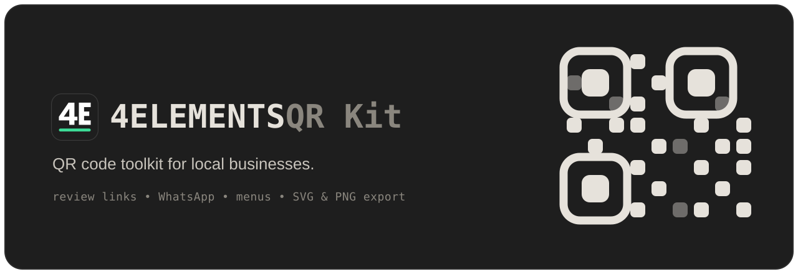

<div align="center">
  

  <p align="center">
    <a href="#features">Features</a> •
    <a href="#getting-started">Getting Started</a> •
    <a href="#how-it-works">How It Works</a> •
    <a href="#tech-stack">Tech Stack</a> •
    <a href="#contributing">Contributing</a>
  </p>

  <p align="center">
    
    
    
    
    
    
  </p>
</div>

---

4ELEMENTS QR Kit is a browser-based QR code toolkit for local businesses. It helps create static QR codes for Google review links, WhatsApp contact, menus, booking pages, Wi-Fi access, contact details and other customer touchpoints. Codes are generated in the browser, so the entered content does not need to be sent to a server. The QR codes are static, do not expire and have no scan limit.

## Features

- Create static QR codes for review links, WhatsApp contact, menus, booking pages, Wi-Fi access and contact details.
- Customize colors, module shapes, corner styles and add a logo.
- Generate codes directly in the browser without requiring an account.
- Export QR codes for use on flyers, signs, menus, table displays and other print materials.
- No watermark, no scan limit and no third-party redirect required for static QR codes.

## Supported QR types

Every type also has its own page (which helps with search) that opens the tool already set to that type.

| Type               | Route                       | What it does                                   |
| ------------------ | --------------------------- | ---------------------------------------------- |
| Google review      | `/google-bewertung-qr-code` | Open the Google review form (URL code)         |
| WhatsApp           | `/whatsapp-qr-code`         | Open a WhatsApp chat via `wa.me` (URL code)    |
| Menu / price list  | `/speisekarte-qr-code`      | Open an online menu or price list (URL code)   |
| Wi-Fi              | `/wlan-qr-code`             | Join a network without typing the password     |
| vCard              | `/visitenkarte-qr-code`     | Add a contact / digital business card          |
| URL                | `/link-qr-code`             | Link to any website                            |
| Phone              | `/telefon-qr-code`          | Tap to call                                    |
| Email              | `/e-mail-qr-code`           | Open a prefilled email                         |
| SMS                | `/sms-qr-code`              | Open a prefilled text message                  |
| Location           | `/standort-qr-code`         | Open GPS coordinates in maps                   |
| Event              | `/termin-qr-code`           | Add an event to the calendar                   |
| Text               | `/text-qr-code`             | Show any message, even offline                 |
| Crypto, raw bytes  | `/`                         | Wallet addresses and arbitrary payloads        |

The upstream English routes (`/wifi-qr-code`, `/vcard-qr-code`, ...) permanently redirect to the German ones.

## Getting Started

### Prerequisites

- Node.js 20 or newer
- [pnpm](https://pnpm.io/) (the repo is set up around it)

### Installation

```bash
# clone the repository
git clone https://github.com/HaydarHinisli/4elements-qr-kit.git
cd 4elements-qr-kit

# install dependencies
pnpm install

# start the dev server
pnpm dev
```

Open [http://localhost:3000](http://localhost:3000) and start making codes.

### Scripts

| Command                                                 | Description                       |
| ------------------------------------------------------- | --------------------------------- |
| `pnpm dev`                                              | Start the development server      |
| `pnpm build`                                            | Create a production build         |
| `pnpm start`                                            | Serve the production build        |
| `pnpm lint`                                             | Run ESLint                        |
| `pnpm release <patch\|minor\|major\|X.Y.Z> "<message>"` | Bump the version, commit, and tag |

## How It Works

A few parts are worth knowing about if you're poking around the code.

**Everything runs on the client.** The QR is drawn in the browser with [`@lglab/react-qr-code`](https://github.com/lostgenius-lab/react-qr-code). No server ever sees your data, and because the content lives inside the code itself, the code keeps working forever.

**The design lives in the URL.** When you change something, the config gets compared against the page defaults and packed into a `?c=` parameter. Small designs use plain Base64, and larger ones switch to `deflate-raw` compression automatically. Refreshing keeps your work, and sharing is just copying the URL.

**It figures out the size before drawing.** [`lib/qr-size.ts`](lib/qr-size.ts) redoes the encoder's version math, so the app can show you the code's dimensions and handle a "too much data" case cleanly instead of crashing mid-render.

**Built with search in mind.** The homepage and every type page are static, each one carrying its own metadata, JSON-LD, Open Graph image ([`lib/og.tsx`](lib/og.tsx)), plus a generated `sitemap.xml` and `robots.txt`.

## Tech Stack

- [Next.js 16](https://nextjs.org/) (App Router, React Compiler, Turbopack)
- [React 19](https://react.dev/) and [TypeScript](https://www.typescriptlang.org/)
- [Tailwind CSS 4](https://tailwindcss.com/) with [Base UI](https://base-ui.com/) primitives
- [Zustand](https://github.com/pmndrs/zustand) for state
- [@lglab/react-qr-code](https://github.com/lostgenius-lab/react-qr-code) for rendering
- [Phosphor Icons](https://phosphoricons.com/) and [react-colorful](https://github.com/omgovich/react-colorful)

## Project Structure

```text
app/                 # routes, metadata, sitemap/robots, OG images
  [slug]/            # per-type landing pages (wlan-qr-code, etc.)
  impressum/         # legal notice
  datenschutz/       # privacy policy (placeholder)
components/
  actions/           # copy, download, share, reset
  landing/           # server-rendered marketing sections + JSON-LD
  layout/            # generator shell, nav, footer, contact hint, legal page frame
  settings/          # the customization panel (content, style, image)
hooks/               # QR value + size derivation
lib/                 # qr-size, share-state codec, page content, OG
stores/code-config/  # Zustand store + provider
```

## Deployment

4ELEMENTS QR Kit is a standard Next.js app, so it runs anywhere that runs Node (Vercel, for example).

Set one environment variable so the canonical URLs, sitemap, and Open Graph tags point at your domain:

```bash
NEXT_PUBLIC_SITE_URL=https://your-domain.com
```

## Contributing

Contributions are welcome. Open an issue if you want to talk something through first, or send a pull request:

1. Fork the repo and make a branch: `git checkout -b feature/my-change`
2. Make your changes, and keep `pnpm lint` and `pnpm build` passing.
3. Open a pull request that explains what you changed and why.

## License

This project is based on QReate by Gabriele Rizzo and is released under the MIT License. See the LICENSE file for details.

---

<div align="center">
  Built by <a href="https://x.com/gabrielerizzoo">Gabriele Rizzo</a>. If QReate is useful to you, consider <a href="https://buymeacoffee.com/gabrielerizzo">buying a coffee</a> ☕
</div>
